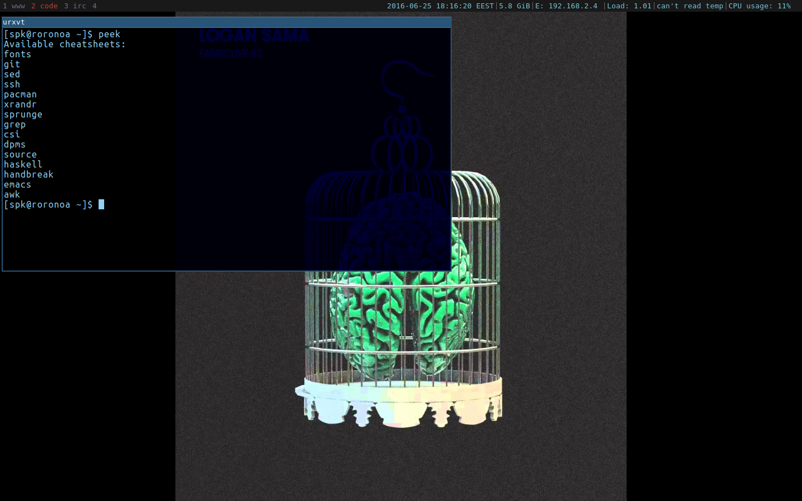
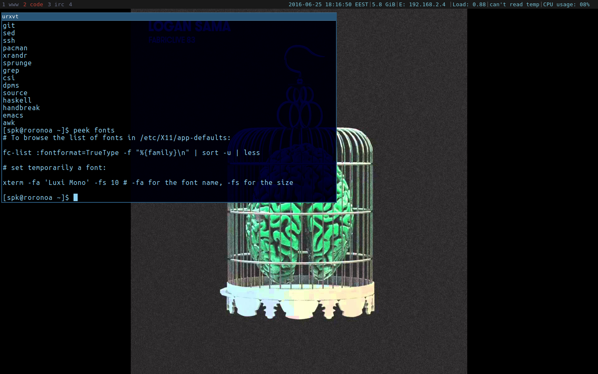

--------------------------------------------------------------------------------
peek 
--------------------------------------------------------------------------------

Peek is a simple cheatsheet handler.

--------------------------------------------------------------------------------
Configuring peek
--------------------------------------------------------------------------------

peek uses by default your $EDITOR variable to edit your cheatsheets. If $EDITOR
is not set, it uses /usr/bin/vi.

So just set your $EDITOR variable. Since the directory that the cheatsheets are
saved is ~/.peek/ , you have to create it and edit config.h to point to it. If
you want a different directory to save your cheatsheets, edit config.h according
to your needs. After making the changes to your config.h continue to installing
peek.

--------------------------------------------------------------------------------
Installing peek
--------------------------------------------------------------------------------
To install run:

1. make

2. sudo make install

--------------------------------------------------------------------------------
Uninstalling peek
--------------------------------------------------------------------------------

To uninstall just run:

sudo make uninstall

--------------------------------------------------------------------------------
Cheatsheets
--------------------------------------------------------------------------------

You can get a sample of cheatheets here:

https://github.com/s-p-k/cheatsheets

Just copy them on your ~/.peek/ directory.

--------------------------------------------------------------------------------
Screenshots
--------------------------------------------------------------------------------

Here peek(1) lists all available cheatsheets:

Supposing we want to read the "fonts" cheatsheet we simply do:

